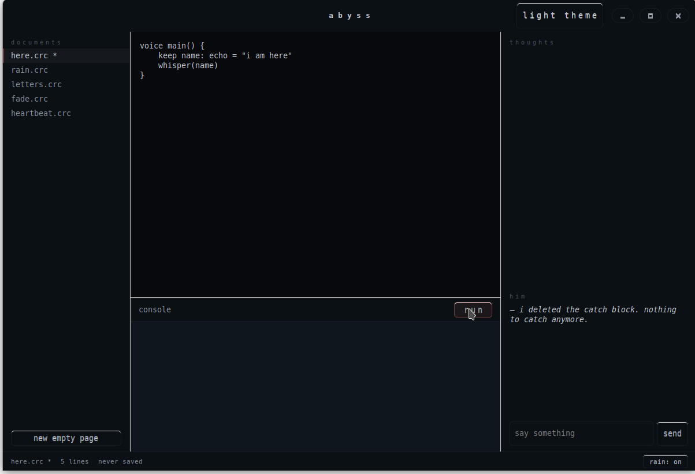

# core-c · abyss

> *"there is no exception handler for missing her."*
> — mark, from the first commit message

**core-c** is a small programming language written in 2024 by **mark** —
a programmer who spent a year grieving someone and stopped being able to
write anything else. **abyss** is the dark-mode-only editor he wrote to
write it in. They are released together because, in mark's words,
*"one without the other doesn't work, the same way most things don't."*

This repo contains:

- `compiler/corec.py` — the reference interpreter for core-c.
- `examples/*.crc` — small core-c programs.
- `ide-native/` — `abyss`, the native GTK3 editor written in C++.
- `docs/STORY.md` — what happened to mark.
- `docs/LANGUAGE.md` — the language reference.
- `docs/IDE.md` — the editor's design notes.



---

## quick taste

```
voice main() {
    keep name: echo = "i am here"
    whisper(name)
}
```

```
$ corec run examples/here.crc
i am here
```

The language has no exceptions. Code either runs, or quietly stops and
writes its last words to a `.tomb` file next to the source. The keyword
for *return* is `fade`. The keyword for *while* is `drown`. There is a
reason for this; it is in `docs/STORY.md`.

---

## install (debian / ubuntu)

```bash
sudo apt install python3 libgtk-3-dev build-essential pkg-config
git clone https://github.com/razikmittp-source/calculator-c-.git
cd calculator-c-
./install.sh
```

`install.sh` puts two commands into `~/.local/bin`:

- `corec` — runs `.crc` files (`corec run my_program.crc`).
- `abyss` — the editor.

If GTK isn't available the installer skips the editor and still gives
you `corec`.

You can also build the editor manually:

```bash
cd ide-native
make
./abyss
```

The editor finds the interpreter through `$COREC_HOME`, then by walking
up from its own location.

---

## what's inside the language

| concept       | core-c             | most languages         |
|---------------|--------------------|------------------------|
| function      | `voice`            | `fn`, `def`, `function`|
| variable      | `keep`             | `let`, `var`           |
| if / elseif   | `perhaps`          | `if`                   |
| else          | `otherwise`        | `else`                 |
| while         | `drown`            | `while`                |
| for-in        | `bury x in …`      | `for x in …`           |
| return        | `fade`             | `return`               |
| true / false  | `still` / `gone`   | `true` / `false`       |
| null          | `void`             | `null`, `nil`, `None`  |
| print         | `whisper(…)`       | `print(…)`             |
| read line     | `listen(…)`        | `input(…)`             |
| comment       | `~~`               | `//`                   |

Types are named after states of being:

| type     | meaning                                |
|----------|----------------------------------------|
| `echo`   | a string. text that came back to you.  |
| `memory` | an integer. countable things.          |
| `pain`   | a float. things between integers.      |
| `shadow` | an array. a list of things that were.  |
| `void`   | nothing. the absence of a value.       |

Full reference: [docs/LANGUAGE.md](docs/LANGUAGE.md).

---

## example: heartbeat

```
voice heartbeat(times: memory) {
    keep n: memory = 0
    drown n < times {
        perhaps n % 2 == 0 {
            whisper("thump.")
        } otherwise {
            whisper("...")
        }
        n = n + 1
    }
}

voice main() {
    heartbeat(6)
    whisper("then nothing.")
}
```

```
thump.
...
thump.
...
thump.
...
then nothing.
```

More examples in `examples/`:

- `here.crc` — the minimum program.
- `rain.crc` — falling drops, function calls.
- `letters.crc` — string arrays and `bury…in` loops.
- `fade.crc` — early returns and `perhaps`.
- `heartbeat.crc` — `drown` and `otherwise`.
- `count_silence.crc` — ranges (`0..n`) and return values.

---

## philosophy (the short version)

> mark wrote this paragraph in the README and never edited it.

1. **failures are silent.** there is no `try/catch`. when an operation
   fails — a bad index, a missing name, a division by zero — the value
   becomes `void`, the program keeps going, and the failure is written
   to a list called the **tomb**. you can read the tomb after the
   program ends. you do not have to.
2. **endings are explicit.** functions only end when you say `fade`.
   without `fade`, the function returns `void`. mark wanted leaving to
   require a word.
3. **state is named.** there are no anonymous booleans called `flag`
   or `done`. truth in core-c is `still`. its absence is `gone`. mark
   insisted.
4. **the editor is part of the language.** abyss is dark because
   *"looking at light hurt that year."* the rain is on by default. the
   editor doesn't display line numbers if you haven't saved in 90
   seconds; mark called those lines *forgotten*.

The longer version is in [docs/STORY.md](docs/STORY.md).

---

## the editor: abyss

A native GTK3 application, ~91 KB, no runtime dependencies beyond
`libgtk-3-0`. It has, from top to bottom:

- a **documents** column with the example files (and any pages you've
  added via "new empty page");
- a code editor with a slow caret (~2.4s cycle);
- a **console** that runs the active document and shows the program's
  output above its **tomb**, if any;
- a **thoughts** pad that just saves what you type to
  `~/.config/abyss/thoughts.txt`. mark called it *"the only file the
  compiler doesn't care about"*;
- a small dialog called **him** — random lines from mark's notebooks
  shown when you send a message;
- a **rain** toggle in the status bar (audio comes from `paplay` or
  `aplay` if either is installed; otherwise the toggle is silent and
  honest about it).

When a program ends with a non-empty tomb the window briefly darkens.

More on this in [docs/IDE.md](docs/IDE.md).

---

## license

MIT. mark didn't read it before adding it. *"i just clicked the one
github suggested,"* he wrote. *"if anyone ever needs to use this for
something good — go ahead. that would be more than i did with it."*
